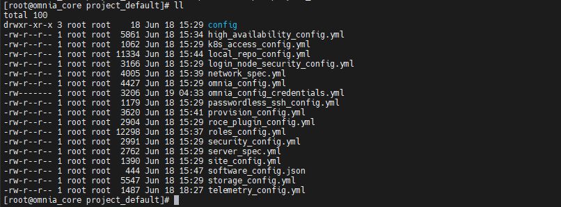

Step 2: Provide inputs to the files in the ``project_default`` directory
===========================================================================

Omnia is now deployed using a project-based approach. Once the ``omnia_core`` container is deployed, all the input files needed for the cluster will be available in the ``/opt/omnia/input/project_default`` directory on the NFS share.
Before moving on to the next step, which is running the ``prepare_oim.yml`` playbook, you must provide inputs for all the files in this directory.

Here's an example of the input files present in the ``project_default`` directory:

