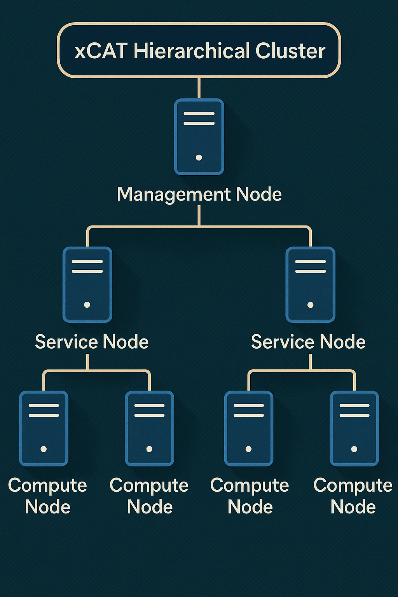

Step 3: xCAT Hierarchical Cluster
==================================

Omnia v2.0 supports Hierarchical cluster provisioning using xCAT.

What is xCAT?
---------------

xCAT (Extreme Cloud Administration Toolkit) is an open-source tool for managing large-scale clusters, supercomputers, and datacenters. 
It automates tasks like hardware provisioning, OS deployment, and system monitoring across thousands of nodes. 
Designed for scalability and flexibility, xCAT supports multiple operating systems and hardware platforms, making it popular in HPC and enterprise environments.

Hierarchical cluster
----------------------

In order to manage large-sized clusters, xCAT helps create a hierarchical cluster. An **xCAT hierarchical cluster** organizes nodes in layers, with a central **Management Node (MN)** overseeing multiple **Service Nodes (SN)**, each managing a group of compute nodes. To know more, `click here <https://xcat-docs.readthedocs.io/en/stable/advanced/hierarchy/index.html>`_.

A typical hierarchical cluster consists of:

* **Management Node**: The top-level node that oversees the entire cluster.

* **Service Nodes**: Intermediate nodes that manage groups of compute nodes. These handle hardware provisioning, OS-deployment, monitoring, and commands for their assigned nodes.

* **Compute Nodes**: The actual worker nodes of the cluster.

Hierarchical cluster in Omnia
-------------------------------

Omnia provisions a hierarchical cluster based on the inputs provided in the ``roles_config.yml`` input file under the ``/opt/omnia/input/project_default/`` directory. For more information, `click here <composable_roles.html>`_.